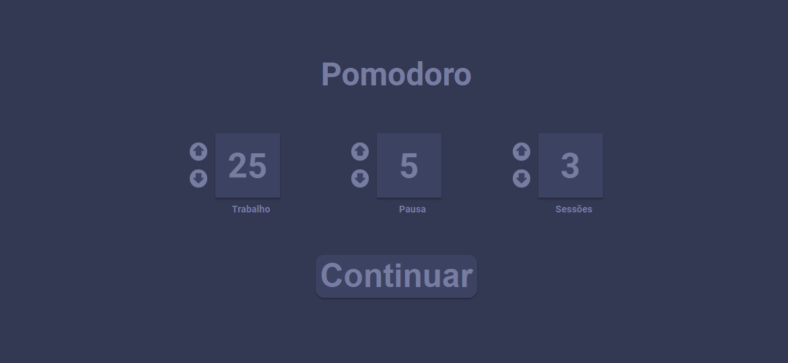
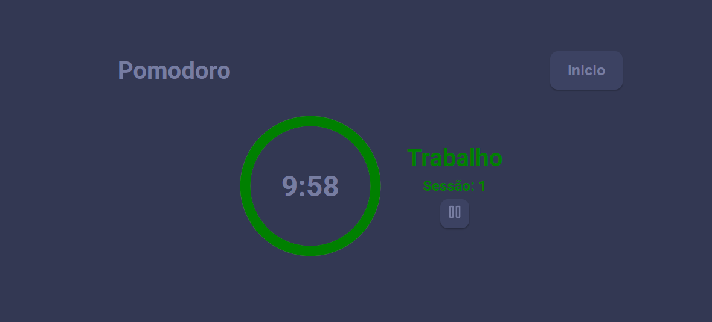
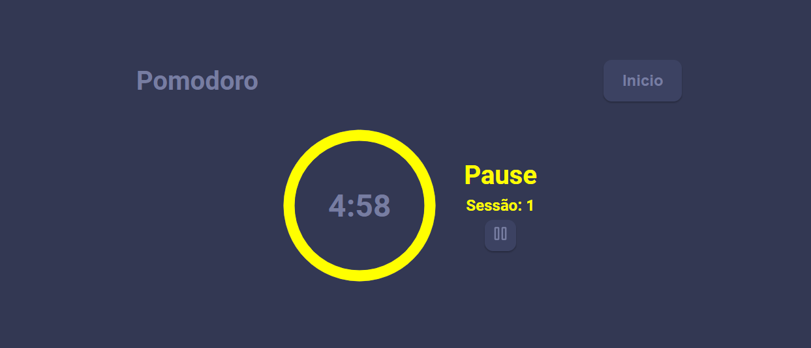
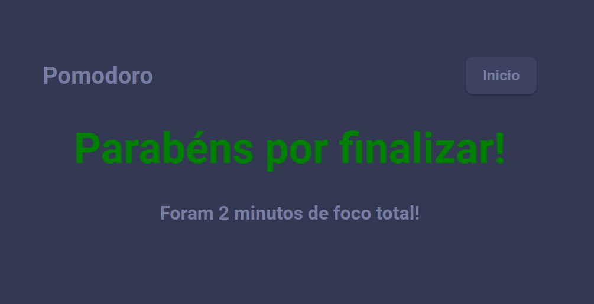

# React Pomodoro

  Project developed to practice the knowledge acquired in reactjs🚀

## 👀 Images

  
  

  
  

## 🚀 Technologies

- [ReactJS](https://reactjs.org/)

## 💻 Getting started

First, clone the project:

    git clone git@github.com:K4ME/Pomodoro.git

Install the dependencies

    npm install

Run the code

    npm run start

  Made with 💜 by <a href="https://www.linkedin.com/in/guilhermemacrini/">Guilherme Macrini</a>

